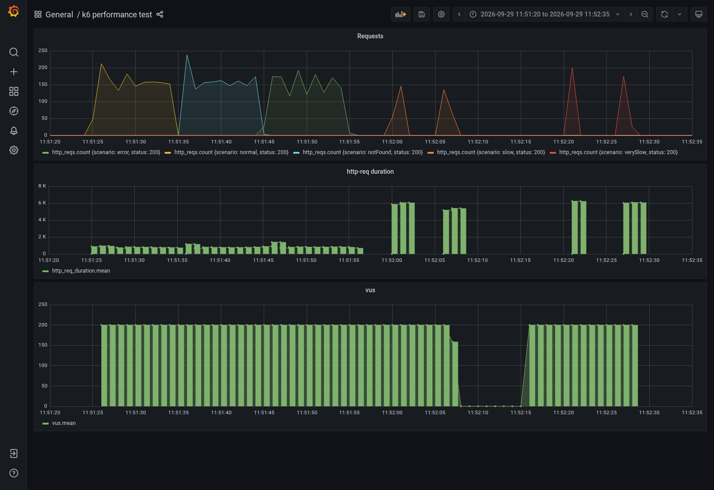

# Cómo evidenciar la evaluación con Grafana y los tests

Grafana visualiza las métricas que genera k6 y almacena InfluxDB. No ejecuta
los tests ni valida por sí mismo que el array de productos sea correcto.

## Evidencia ya disponible

[Dashboard con el intervalo de la ejecución final](http://localhost:3000/d/Le2Ku9NMk/k6-performance-test?orgId=1&from=1790675480000&to=1790675555000)

Intervalo: **29/09/2026, 11:51:20–11:52:35, Europe/Madrid**
(09:51:20–09:52:35 UTC). El dashboard abre normalmente los últimos 30 minutos;
si una ejecución es anterior, hay que seleccionar su intervalo histórico.
El enlace anterior ya lo selecciona y requiere los contenedores locales activos.



Se revisó visualmente el dashboard y se consultó InfluxDB. La evidencia de
conteos queda en [grafana-http-status.json](grafana-http-status.json):

| Escenario | Peticiones registradas | Estado HTTP |
| --- | ---: | --- |
| normal | 1 508 | 200 |
| notFound | 1 483 | 200 |
| error | 1 428 | 200 |
| slow | 400 | 200 |
| verySlow | 400 | 200 |
| Total | **5 219** | **Todas 200** |

`notFound` y `error` provocan fallos en un detalle similar. La respuesta de la
aplicación es 200 con los demás productos por la política de resultados
parciales. Una consulta de IDs que devuelve 404 sí produce un 404 de la
aplicación; ese caso se verifica con los tests de integración y el smoke.

## Qué demuestra cada panel

- **Requests:** número de peticiones por segundo, separado por escenario y
  estado HTTP. Los cambios de color corresponden a los cinco escenarios.
- **http-req duration:** media del tiempo de respuesta agrupada por segundo.
  Los valores procedentes de k6 están en milisegundos: aproximadamente 6 K
  significa 6 000 ms, es decir, 6 s. Este panel NO representa el p95.
- **vus:** usuarios virtuales activos. Los escenarios utilizan 200 usuarios.
  La pausa visible antes del último escenario responde a su `startTime` y a
  la finalización del escenario anterior; no implica por sí sola una caída.

Las peticiones lentas se registran al finalizar, por eso sus curvas pueden
aparecer en grupos de picos. Menos peticiones completadas no equivale por sí
solo a pérdida de datos: cada usuario espera la respuesta y después 0,5 s.

## Demostración reproducible

Desde la raíz del repositorio, con Docker y Compose >= 2.24:

```sh
docker compose -p nunegal -f docker-compose.yaml -f compose.app.yaml up -d --build app influxdb grafana
curl --fail --retry 30 --retry-connrefused --retry-delay 1 --max-time 2 --retry-max-time 60 http://localhost:5000/actuator/health
```

Abre Grafana, selecciona **Last 5 minutes** y una actualización de **5s**.
Anota la hora de inicio y de fin para aislar la ejecución después. Ejecuta el
script proporcionado por la prueba:

```sh
docker compose -p nunegal -f docker-compose.yaml -f compose.app.yaml run --rm k6 run scripts/test.js
```

Espera a que termine antes de ejecutar el test complementario. Así no mezclas
ambas cargas ni sumas usuarios de dos ejecuciones:

```sh
docker compose -p nunegal -f docker-compose.yaml -f compose.app.yaml run --rm -v "$PWD/scripts:/verification:ro" k6 run /verification/verify.js
```

Para evidenciar las pruebas unitarias y de integración:

```sh
./scripts/maven-docker.sh test
```

Si tienes Java 21 y Maven instalados, puedes usar `mvn test` directamente.

## Qué mostrar en la revisión técnica

1. El [script original](../shared/k6/test.js) define cinco escenarios de 200
   usuarios y no contiene checks ni thresholds.
2. La captura de Grafana demuestra que hubo tráfico, sus estados, los tiempos
   y los usuarios activos en un intervalo identificado.
3. El [resumen del k6 original](k6-original-final.txt) muestra 5 219 peticiones,
   p95 global de 6,07 s y máximo de 6,41 s.
4. El [resumen del test complementario](k6-checks-final.txt) muestra **11 502
   checks correctos de 11 502**: comprueba estado y productos esperados en orden.
   Es otra ejecución, con 5 751 peticiones y dos checks por petición.
5. El [resumen Maven](maven-test.txt) muestra **32 pruebas sin fallos**;
   los resultados detallados están en `target/surefire-reports/` después de
   ejecutar Maven. Cubren casos que el k6 original no comprueba.
6. El [informe](verification.md) explica los ajustes de conexiones y sus límites.

No atribuir al dashboard las comprobaciones funcionales ni confundir la media
por segundo con el p95 de toda una ejecución. Mantener separadas las evidencias
del script original y del complementario.

Los datos históricos dependen de conservar el almacenamiento de InfluxDB. El
Compose original no declara un volumen de persistencia gestionado por el
proyecto; al recrear contenedores no se debe dar por garantizada la recuperación
de esas métricas. La captura y los resúmenes guardados son evidencia independiente.
